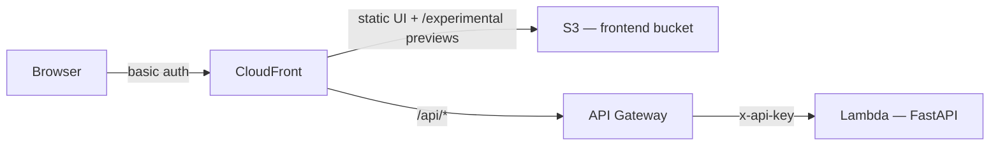
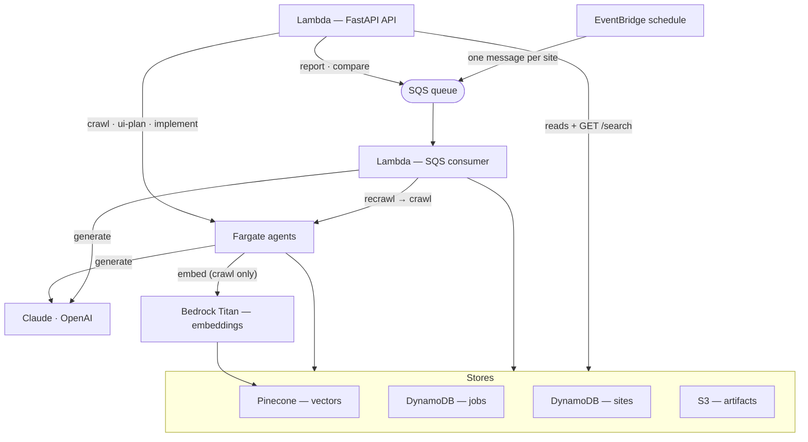
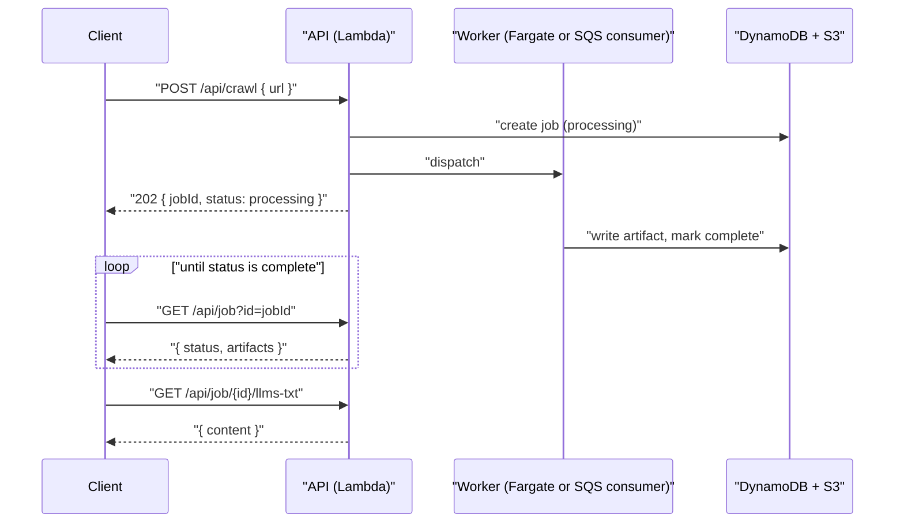

# llms.txt Crawler

Give it a website URL and it produces four things — an [`llms.txt`](https://llmstxt.org/) document, a UI implementation plan, a structured analysis report, and a cross-model comparison — plus semantic search over everything it has crawled. It runs as a FastAPI app on AWS Lambda, with the slow agent work offloaded to background workers.

Crawl, report, and compare can each run on **Anthropic Claude** or **OpenAI**, so you can put the two models' output side by side.

## How a request reaches the API

The browser only ever talks to CloudFront. CloudFront serves the static UI from S3 and proxies API calls to the Lambda; everything is gated by basic auth.



## How jobs run

The API itself is fast. Anything slow is handed to one of two background lanes and the caller polls for the result:

- **Fargate** runs the long agent jobs — `crawl`, `ui-plan`, `implement` (minutes each).
- **SQS → Lambda** runs `report` and `compare`. They're short, but routing them through a queue that re-invokes the Lambda keeps them off the API request, which has a 30 s timeout.
- **Search** is the one synchronous job — it runs inside the API call and returns immediately.
- **Recrawl** is an EventBridge schedule that fans every known site URL onto the same SQS queue, which the Lambda drains as fresh crawl jobs.

Both lanes write artifacts to the same stores; only crawl embeds into Pinecone.



## Job lifecycle

Every job-producing endpoint is asynchronous: it returns a `jobId` right away, then the client polls `GET /api/job` until the artifacts are complete.



## Endpoints

All routes are served under the `/api` prefix.

| Method | Path | Purpose |
| --- | --- | --- |
| POST | `/api/crawl` | Start a crawl — produces the llms.txt + UI plan |
| GET | `/api/job?id=<jobId>` | Poll one job's status and per-artifact state |
| GET | `/api/job/{id}/llms-txt` | Fetch the llms.txt artifact |
| GET | `/api/job/{id}/plan` | Fetch the UI plan artifact |
| GET | `/api/job/{id}/report` | Fetch the report artifact |
| GET | `/api/job/{id}/comparison` | Fetch the comparison artifact |
| GET | `/api/job/{id}/pr-url` | Fetch an implement job's PR URL + preview URL |
| GET | `/api/jobs?model=<claude\|openai>` | List all jobs (the `model` filter is optional) |
| GET | `/api/site?url=<url>` | Latest site record + crawl history for a URL |
| GET | `/api/search?q=<query>` | Semantic search over crawled content (synchronous) |
| POST | `/api/report` | Generate a report on **both** models for a crawled URL |
| POST | `/api/compare` | Compare the latest report from each model for a URL |
| POST | `/api/implement` | Open a GitHub PR for a UI plan and publish a live preview |

### Request bodies

- **`POST /api/crawl`** — `{ "url": "...", "model"?: "claude" | "openai" }` (defaults to `claude`).
- **`POST /api/report`** — `{ "url": "..." }`. Fires both models and returns `{ "jobIdClaude", "jobIdOpenai", "status" }`. `404` if the URL was never crawled.
- **`POST /api/compare`** — `{ "url": "...", "model"?: "claude" | "openai" }`. Auto-finds the latest completed report for each model, then runs the comparison on the chosen `model` (default `claude`). Returns `{ "jobId", "status" }`, or `404` naming the model whose report is missing.
- **`POST /api/implement`** — `{ "job_id": "<crawl job with a completed plan>" }`. Returns `{ "jobId", "status" }`.

### Implement previews

`POST /api/implement` does two things: it opens a GitHub PR implementing the UI plan, and it publishes the built UI to `s3://<frontend-bucket>/experimental/<jobId>/`. Because CloudFront serves that bucket, the result is live at `<cloudfront-url>/experimental/<jobId>/` (behind the same basic auth). Both links come back from `GET /api/job/{id}/pr-url` as `prUrl` and `previewUrl`.

### Site metadata

Each crawl extracts structured, search-filterable metadata stored on the site record (`GET /api/site`): `site_category`, `primary_topics`, `tech_stack`, `integrations`, `business_model`, `target_audience`, `content_tone`, `has_public_api`, and `languages`.

Full request/response schemas live in the Pydantic models in `src/models.py`.

## Local setup

**Prerequisites:** [uv](https://docs.astral.sh/uv/), Python 3.11+, and AWS credentials with access to DynamoDB, S3, and Bedrock.

Create a `.env` file (gitignored) with the following variable **names** — supply your own values:

| Variable | Purpose |
| --- | --- |
| `ANTHROPIC_API_KEY` | Anthropic API key (local fallback for the Lambda secrets extension) |
| `OPENAI_API_KEY` | OpenAI API key (local fallback) |
| `PINECONE_API_KEY` | Pinecone API key (local fallback) |
| `PINECONE_INDEX` | Pinecone index name |
| `BUCKET` | S3 bucket for artifact content |
| `TABLE` | DynamoDB jobs table name |
| `SITES_TABLE` | DynamoDB sites table name |
| `AWS_DEFAULT_REGION` | AWS credentials region (the app itself is pinned to `us-east-1` in `src/constants.py`) |
| `ECS_CLUSTER`, `ECS_TASK_DEFINITION`, `ECS_IMPLEMENT_TASK_DEFINITION`, `ECS_SUBNET_IDS`, `ECS_SECURITY_GROUP` | Required only to dispatch Fargate tasks (crawl, ui-plan, implement) |
| `FRONTEND_BUCKET`, `CLOUDFRONT_URL` | Required only by the implement task to publish `/experimental` previews |
| `RECRAWL_QUEUE_URL` | SQS queue URL for the recrawl handler |

The `Makefile` loads `.env` into the shell automatically. Then:

```bash
make setup   # create venv and install dependencies
make run     # uvicorn dev server on :8000
make test    # pytest
make lint    # ruff check --fix
make format  # ruff format
```

## Deployment

```bash
make build       # build.sh → lambda.zip (Linux wheels for the Lambda runtime)
make docker-push # build + push the Fargate agent image to ECR
make tf-apply    # terraform init + apply (provide pinecone_index, vpc_id, subnet_ids, basic_auth_password)
```

Secrets are read from AWS Secrets Manager via the Lambda Parameters and Secrets Extension — never committed or passed as Terraform variables.

## Project layout

```
src/
  handler.py          # FastAPI app + Lambda entrypoint (dispatches by event shape)
  constants.py        # model IDs, tool lists, config thresholds
  models.py           # Pydantic request/response and agent output models
  prompts.py          # system prompts + message builders for each agent
  index.html          # static UI served from S3 via CloudFront
  agents/             # reporter, comparer (run via the SQS consumer)
  tasks/              # Fargate agent entrypoints (crawl, ui-plan, implement)
  services/           # storage, embeddings, pinecone_client, llm, fargate, recrawl, search, ...
infra/
  main.tf             # wires modules together
  modules/            # s3, dynamodb, lambda, api_gateway, observability, cloudfront, sqs, ecs, iam
tests/                # one test file per source module
```

See [`CLAUDE.md`](./CLAUDE.md) for contributor conventions (code style, error handling, testing, PR format).
