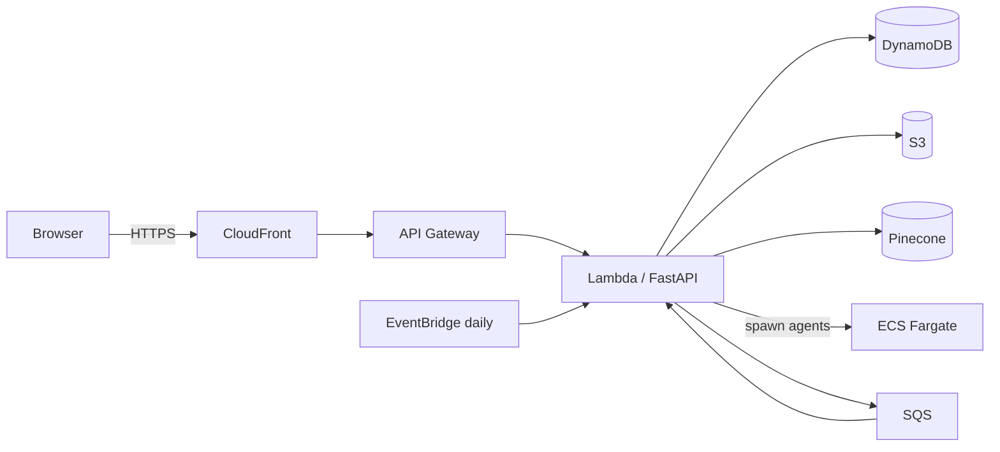

# llms.txt Crawler

A web crawler that visits any URL, extracts structured content using Claude, and produces an [`llms.txt`](https://llmstxt.org) file — a standardised format that lets LLMs understand what a site does and how to use it. Jobs run on ECS Fargate and results are queryable via vector search.



## Local setup

**Prerequisites:** Python 3.11+, [uv](https://docs.astral.sh/uv/), AWS credentials with access to the deployed stack.

```bash
make setup   # create venv and install deps
make run     # starts FastAPI on http://localhost:8000
```

Create a `.env` file with values from `terraform output` — see [Deployment](docs/deploy.md) for the full list of required variables.

Interactive API docs are available at `http://localhost:8000/docs` once running.

## Running tests

```bash
make test    # pytest (all AWS calls mocked)
make lint    # ruff check
```

## Docs

- [Architecture](docs/architecture.md) — system components and data flows
- [API Reference](docs/api.md) — endpoint summary
- [Deployment](docs/deploy.md) — build, terraform, and post-deploy steps
