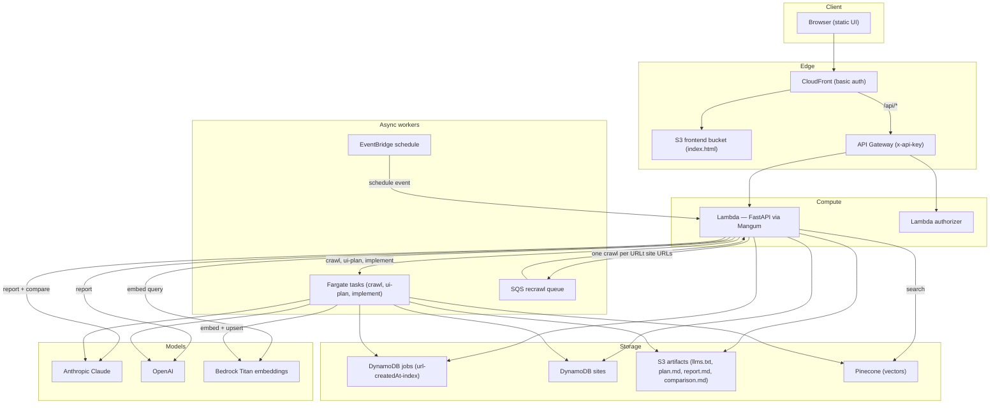
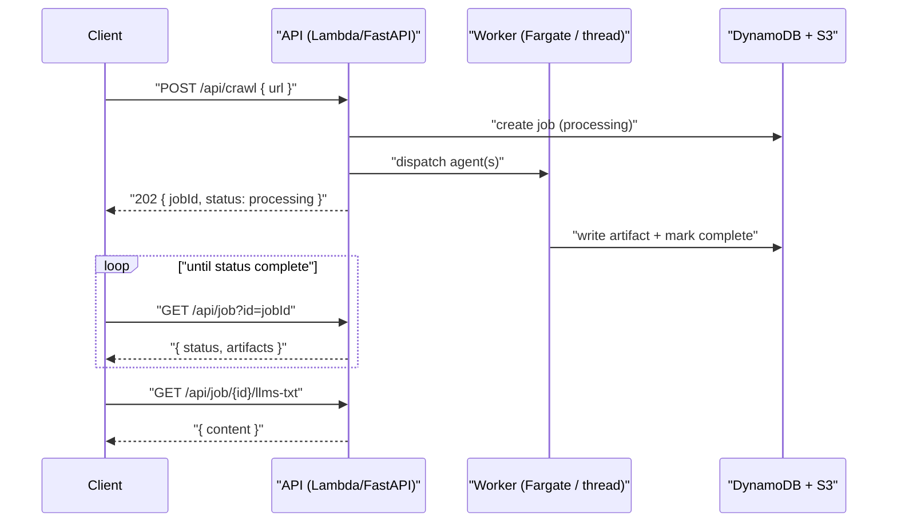

# llms.txt Crawler

Give it a website URL and it crawls the site to produce an [`llms.txt`](https://llmstxt.org/) document, a UI implementation plan, structured analysis reports, and cross-model comparisons — plus semantic search over everything it has crawled. It runs as a FastAPI app on AWS Lambda, with long-running agent work offloaded to Fargate. Crawl, report, and compare can each run on Anthropic Claude or OpenAI models so their outputs can be compared side by side.

## Architecture



Crawl, UI-plan, and implement agents run as long-lived Fargate tasks. Report and compare are short enough to run in-process inside the Lambda on a background thread. Recrawl is driven by an EventBridge schedule that fans every known site URL onto an SQS queue, which the Lambda drains and re-dispatches as crawl tasks.

## Request lifecycle

Job-producing endpoints are asynchronous: they return a `jobId` immediately and the client polls `GET /api/job` until the artifacts are complete.



## Endpoints

All routes are served under the `/api` prefix.

| Method | Path | Purpose | Uses |
| --- | --- | --- | --- |
| POST | `/api/crawl` | Start a crawl: generates llms.txt + UI plan | Fargate, DynamoDB |
| GET | `/api/job` | Poll job status and per-artifact state | DynamoDB |
| GET | `/api/job/{id}/llms-txt` | Fetch the llms.txt artifact | S3 |
| GET | `/api/job/{id}/plan` | Fetch the UI plan artifact | S3 |
| GET | `/api/job/{id}/report` | Fetch the report artifact | S3 |
| GET | `/api/job/{id}/comparison` | Fetch the comparison artifact | S3 |
| GET | `/api/jobs` | List all jobs (optional `model` filter) | DynamoDB |
| GET | `/api/site` | Latest site record + crawl history for a URL | DynamoDB |
| GET | `/api/search` | Semantic search over crawled content (synchronous) | Pinecone, Bedrock Titan |
| POST | `/api/report` | Generate a report for a crawled URL on both models | Anthropic, OpenAI |
| POST | `/api/compare` | Compare the latest report from each model for a URL | Anthropic |
| POST | `/api/implement` | Open a GitHub PR implementing a completed UI plan | Fargate |

`POST /api/report` and `POST /api/compare` both take a body of `{ "url": "..." }` only:

- **`/api/report`** fires both models and returns `{ "jobIdClaude": "...", "jobIdOpenai": "...", "status": "processing" }`. Returns `404` if the URL was never crawled.
- **`/api/compare`** auto-finds the latest completed report per model for the URL and returns `{ "jobId": "...", "status": "processing" }`. Returns `404` naming the missing model if either model lacks a completed report.

Full request/response schemas are available from FastAPI's interactive docs at `/docs` and `/redoc`.

## Local setup

**Prerequisites:** [uv](https://docs.astral.sh/uv/), Python 3.11+, and AWS credentials with access to DynamoDB, S3, and Bedrock.

Create a `.env` file (gitignored) with the following variable **names** — supply your own values:

| Variable | Purpose |
| --- | --- |
| `ANTHROPIC_API_KEY` | Anthropic API key (local fallback for the Lambda secrets extension) |
| `OPENAI_API_KEY` | OpenAI API key (local fallback) |
| `PINECONE_API_KEY` | Pinecone API key (local fallback) |
| `PINECONE_INDEX` | Pinecone index name |
| `BUCKET` | S3 bucket for artifact content |
| `TABLE` | DynamoDB jobs table name |
| `SITES_TABLE` | DynamoDB sites table name |
| `AWS_DEFAULT_REGION` | AWS region (optional; defaults to `us-east-1`) |
| `ECS_CLUSTER`, `ECS_TASK_DEFINITION`, `ECS_SUBNET_IDS`, `ECS_SECURITY_GROUP` | Required only to dispatch Fargate tasks (crawl, ui-plan, implement) |
| `RECRAWL_QUEUE_URL` | SQS queue URL for the recrawl handler |

The `Makefile` loads `.env` into the shell automatically. Then:

```bash
make setup   # create venv and install dependencies
make run     # uvicorn dev server on :8000
make test    # pytest
make lint    # ruff check --fix
make format  # ruff format
```

## Deployment

```bash
make build     # build.sh → lambda.zip (Linux wheels for the Lambda runtime)
make tf-apply  # terraform init + apply (provide pinecone_index, vpc_id, subnet_ids, basic_auth_password)
```

Secrets are read from AWS Secrets Manager via the Lambda Parameters and Secrets Extension — never committed or passed as Terraform variables.

## Project layout

```
src/
  handler.py          # FastAPI app + Lambda entrypoint (dispatches by event shape)
  constants.py        # model IDs, tool lists, config thresholds
  models.py           # Pydantic request/response and agent output models
  prompts.py
  index.html          # static UI served from S3 via CloudFront
  agents/             # reporter, comparer (in-process agents)
  tasks/              # Fargate agent entrypoints (crawl, ui-plan, implement)
  services/           # storage, embeddings, pinecone_client, llm, fargate, recrawl, search, ...
infra/
  main.tf             # wires modules together
  modules/            # s3, dynamodb, lambda, api_gateway, observability, cloudfront, sqs, ecs, iam
tests/                # one test file per source module
```

See [`CLAUDE.md`](./CLAUDE.md) for contributor conventions (code style, error handling, testing, PR format).
