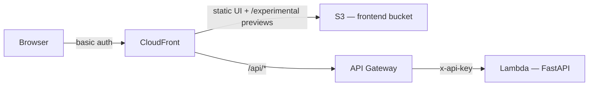

# llms.txt Crawler

Give it a website URL and it produces four things — an [`llms.txt`](https://llmstxt.org/) document, a UI implementation plan, a structured analysis report, and a cross-model comparison — plus semantic search over everything it has crawled. It runs as a FastAPI app on AWS Lambda, with the slow agent work offloaded to background workers.

Crawl, report, and compare can each run on **Anthropic Claude** or **OpenAI**, so you can put the two models' output side by side.

## Demo


A full tour — crawl, semantic search, reports, comparison, history, and the reskin step that restyles the app's own UI from a crawled site — with screenshots of every page is in **[docs/demo](docs/demo/)**.

## Architecture at a glance

The browser only ever talks to CloudFront. CloudFront serves the static UI from S3 and proxies API calls to the Lambda; everything is gated by basic auth.



The API itself is fast; anything slow is handed to a background worker and the caller polls for the result. See the docs below for the full picture.

## Documentation

- **[Demo](docs/demo/)** — screenshots of every page, the walkthrough GIF, and reskin examples.
- **[Architecture](docs/architecture.md)** — how jobs run, the two async lanes, and the request lifecycle.
- **[API reference](docs/endpoints.md)** — every endpoint, request bodies, implement previews, and site metadata.
- **[Build plans](plans/)** — historical phased build specs, kept for reference; the docs above are the source of truth for the current system.

## Local setup

**Prerequisites:** [uv](https://docs.astral.sh/uv/), Python 3.11+, and AWS credentials with access to DynamoDB, S3, and Bedrock.

Create a `.env` file (gitignored) with the following variable **names** — supply your own values:

| Variable | Purpose |
| --- | --- |
| `ANTHROPIC_API_KEY` | Anthropic API key (local fallback for the Lambda secrets extension) |
| `OPENAI_API_KEY` | OpenAI API key (local fallback) |
| `PINECONE_API_KEY` | Pinecone API key (local fallback) |
| `PINECONE_INDEX` | Pinecone index name |
| `BUCKET` | S3 bucket for artifact content |
| `TABLE` | DynamoDB jobs table name |
| `SITES_TABLE` | DynamoDB sites table name |
| `AWS_DEFAULT_REGION` | Region for the boto3 ECS client (the app's fixed region lives in `AWS_REGION` in `src/constants.py`) |
| `ECS_CLUSTER`, `ECS_TASK_DEFINITION`, `ECS_IMPLEMENT_TASK_DEFINITION`, `ECS_SUBNET_IDS`, `ECS_SECURITY_GROUP` | Required only to dispatch Fargate tasks (crawl, ui-plan, implement) |
| `FRONTEND_BUCKET`, `CLOUDFRONT_URL` | Required only by the implement task to publish `/experimental` previews |
| `RECRAWL_QUEUE_URL` | SQS queue URL for the recrawl handler |
| `ECR_URL` | ECR repository URL for the Fargate agent image (used by `make docker-push`) |

The `Makefile` loads `.env` into the shell automatically. Then:

```bash
make setup   # create venv and install dependencies
make run     # uvicorn dev server on :8000
make test    # pytest
make lint    # ruff check --fix
make format  # ruff format
make local-task  # run one agent task locally vs real AWS (override AGENT_URL, AGENT_MODEL, AGENT_TYPE)
```

## Deployment

```bash
make build       # build.sh → lambda.zip (Linux wheels for the Lambda runtime)
make docker-push # build + push the Fargate agent image to ECR
make tf-apply    # terraform init + apply (provide pinecone_index, vpc_id, subnet_ids, basic_auth_password)
```

## Project layout

```
src/
  handler.py          # FastAPI app + Lambda entrypoint (dispatches by event shape)
  constants.py        # model IDs, tool lists, config thresholds
  models.py           # Pydantic request/response and agent output models
  prompts.py          # system prompts + message builders for each agent
  index.html          # static UI served from S3 via CloudFront
  agents/             # reporter, comparer (run via the SQS consumer)
  tasks/              # Fargate agent entrypoints (crawl, ui-plan, implement)
  services/           # storage, embeddings, pinecone_client, llm, fargate, recrawl, search, ...
docs/                 # architecture + API reference
infra/
  main.tf             # wires modules together
  modules/            # s3, dynamodb, lambda, api_gateway, observability, cloudfront, sqs, ecs, iam
tests/                # one test file per source module
```
