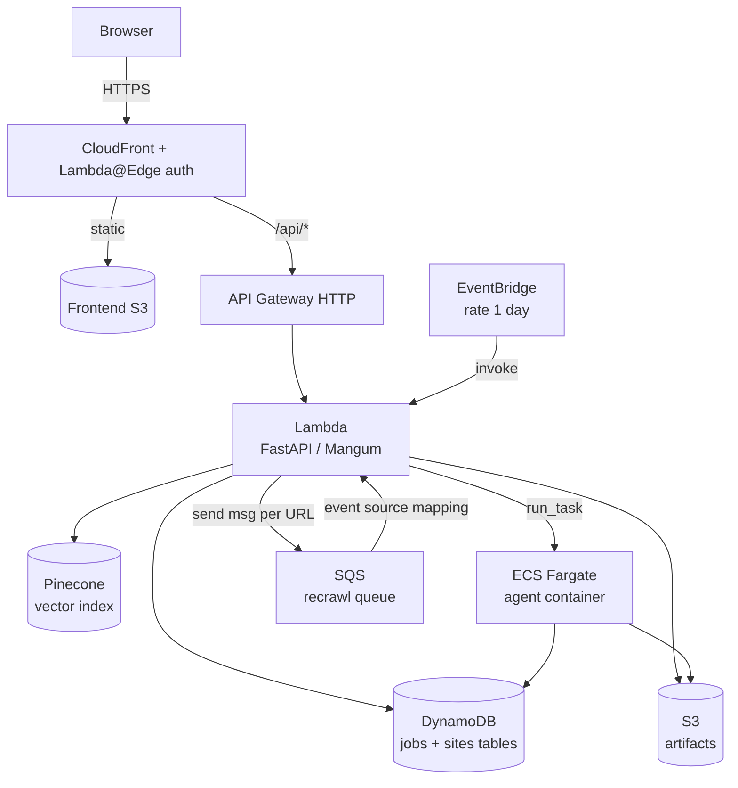
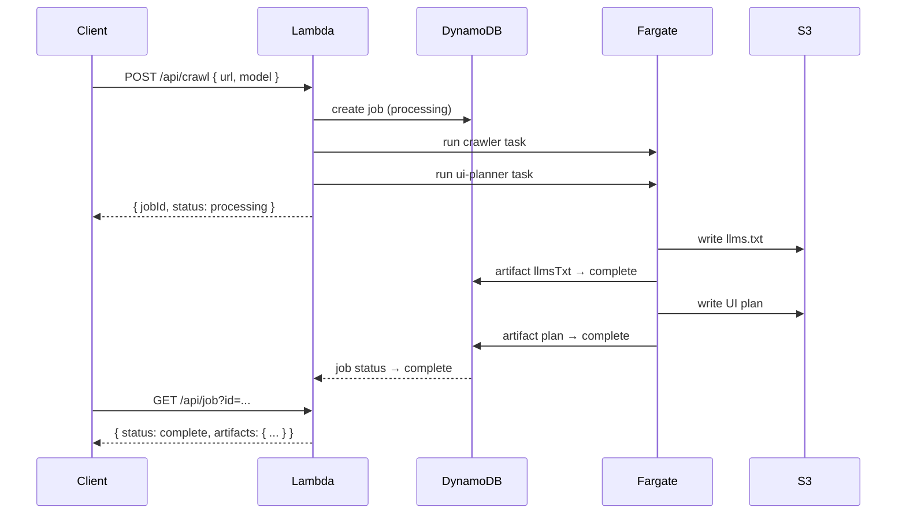
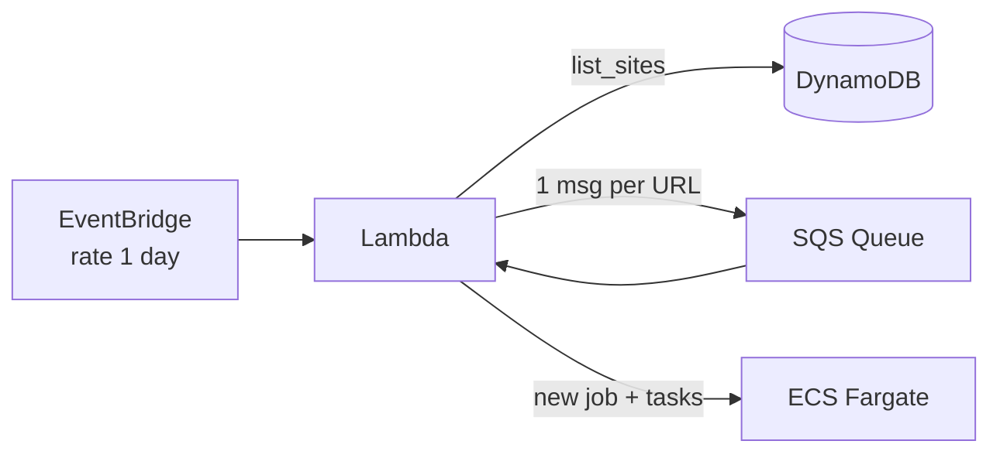

# Architecture

## System Overview

**Lambda** is the single entry point. It handles HTTP requests via FastAPI + Mangum, acts as an API Gateway authorizer, processes SQS messages, and handles EventBridge scheduled events — all dispatched by event shape in `handler.py`.

**ECS Fargate** runs the long-running agent tasks (crawl, UI plan, report, compare, implement). The Lambda dispatches tasks via `ecs.run_task` and returns immediately; agents write results directly to S3 and DynamoDB.

**Pinecone** stores embeddings of each `llms.txt` file alongside site metadata, enabling semantic search across all crawled sites.

**CloudFront** serves the frontend from S3 and proxies API requests to API Gateway. A Lambda@Edge function injects a secret `x-api-key` header on origin requests; API Gateway uses a Lambda authorizer to verify it. Access to the site is controlled by HTTP basic auth configured on the CloudFront distribution.

---

## Job Lifecycle

---

## Scheduled Re-crawl

Every 24 hours EventBridge invokes Lambda, which reads all indexed URLs from DynamoDB and enqueues one SQS message per URL. The SQS event source mapping re-invokes Lambda per message, which creates a new job and dispatches fresh Fargate tasks.

---

## Agent Types

| Agent | Trigger | Output |
|---|---|---|
| `crawl` | POST /api/crawl | `llms.txt` file in S3, embedding in Pinecone |
| `ui-plan` | POST /api/crawl | UI implementation plan in S3 |
| `report` | POST /api/report | Site analysis report in S3 |
| `compare` | POST /api/compare | Diff comparison between two crawl jobs in S3 |
| `implement` | POST /api/implement | GitHub PR opened against the repo |
