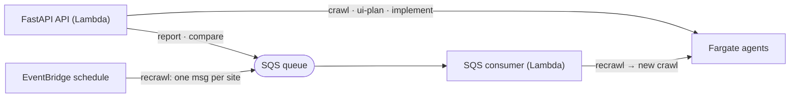
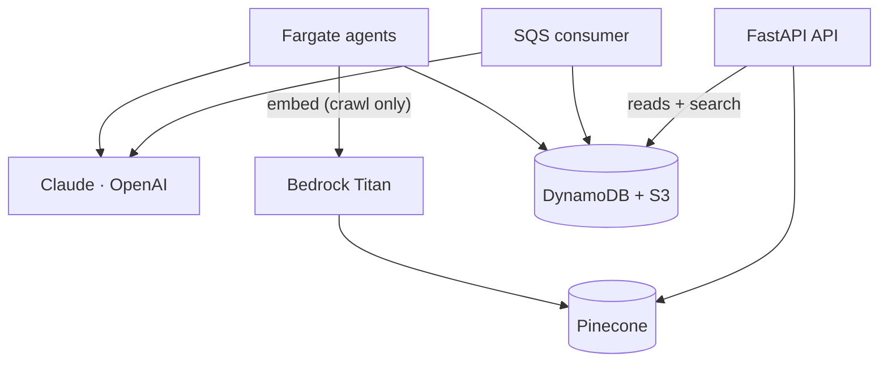
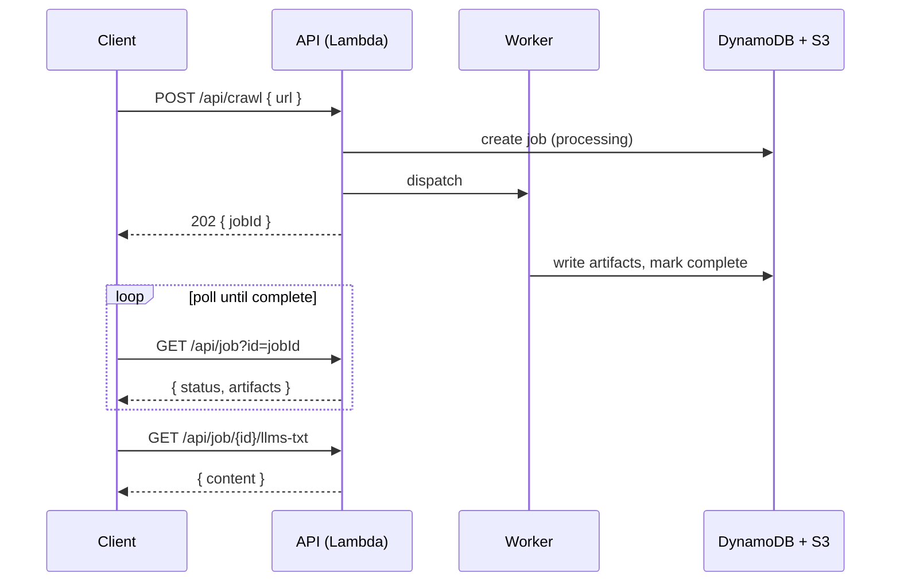

# Architecture

The system is a FastAPI app running on AWS Lambda. The Lambda answers fast requests directly and offloads anything slow to one of two background lanes; clients poll for the result.

For how a request reaches the API (CloudFront → API Gateway → Lambda), see the diagram in the [README](../README.md#architecture-at-a-glance).

## How jobs run

Work is routed to one of two lanes:

- **Fargate** runs the long agent jobs — `crawl`, `ui-plan`, `implement` (minutes each).
- **SQS → Lambda** runs `report` and `compare`. They're short, but routing them through a queue that re-invokes the Lambda keeps them off the API request, which has a 30 s timeout.
- **Search** is the one synchronous job — it runs inside the API call and returns immediately.
- **Recrawl** is an EventBridge schedule that fans every known site URL onto the same SQS queue; the consumer drains them as fresh crawl jobs.

## What the workers write

Both lanes call the model providers and write to the same stores. Only the crawl path embeds into Pinecone (via Bedrock Titan); the API reads back from the stores to serve `GET` requests and search.

DynamoDB holds two tables — `jobs` (one record per crawl/report/compare/implement run) and `sites` (the latest record per URL, with the search-filterable metadata). S3 holds the artifact content (`llms.txt`, `plan.md`, `report.md`, `comparison.md`).

## Request lifecycle

Every job-producing endpoint is asynchronous: it returns a `jobId` immediately, then the client polls `GET /api/job` until the artifacts are complete. The worker is a Fargate task (crawl/ui-plan/implement) or the SQS consumer (report/compare).

A single `POST /api/crawl` dispatches **two** Fargate tasks under one `jobId` — the crawler and the UI planner — which is why one crawl yields both the `llms.txt` and the UI plan artifacts.

See the [API reference](endpoints.md) for the full endpoint list and request/response shapes.
