# Demo

A tour of the llms.txt crawler — give it a URL and it produces an `llms.txt`, a UI plan, a
structured report, and a cross-model comparison, with semantic search over everything crawled.
All screenshots are the **live system**.

## Architecture

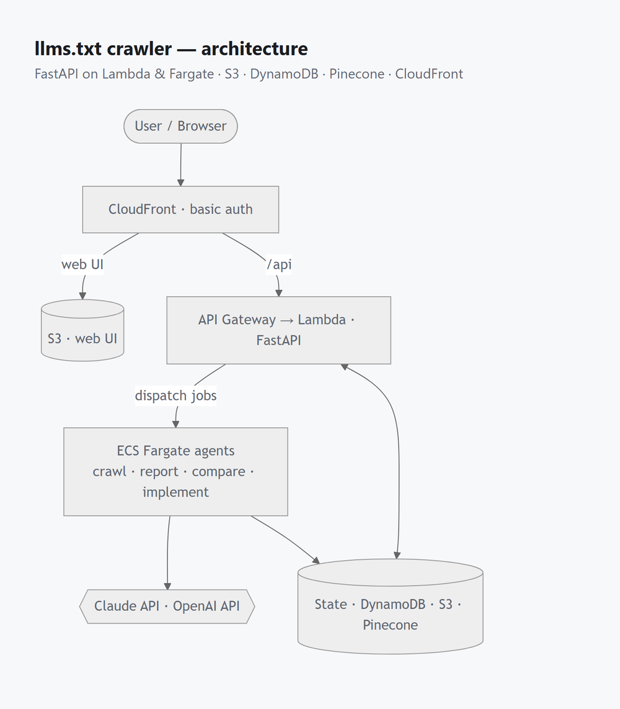

The browser only talks to CloudFront: it serves the static UI from S3 and proxies `/api` to the
Lambda. The Lambda keeps the API fast and dispatches slow agent work (crawl, report, compare,
implement) to ECS Fargate. Agents call the Claude and OpenAI APIs; state lives in DynamoDB
(jobs & sites), S3 (artifacts + previews), and Pinecone (embeddings).

## Pages

Click any thumbnail to open it full size.

<table>
  <tr>
    <td width="33%" align="center" valign="top">
      <a href="img/crawl.png">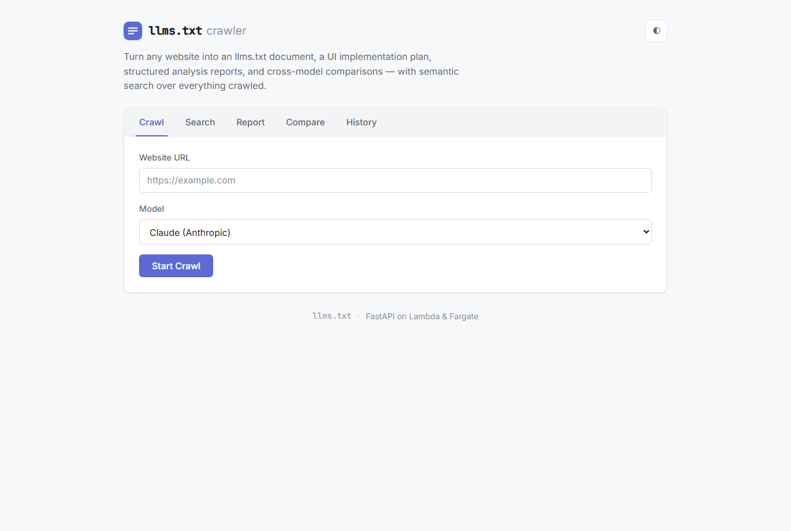</a> 
      <b>Crawl</b> · URL + model
    </td>
    <td width="33%" align="center" valign="top">
      <a href="img/search.png">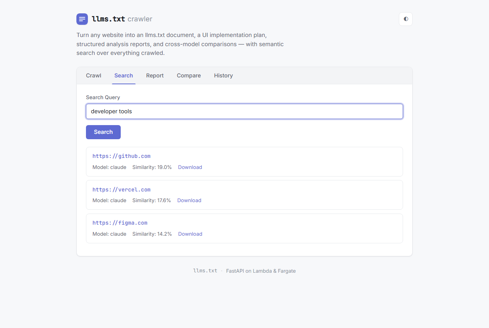</a> 
      <b>Search</b> · semantic top-3
    </td>
    <td width="33%" align="center" valign="top">
      <a href="img/report.png">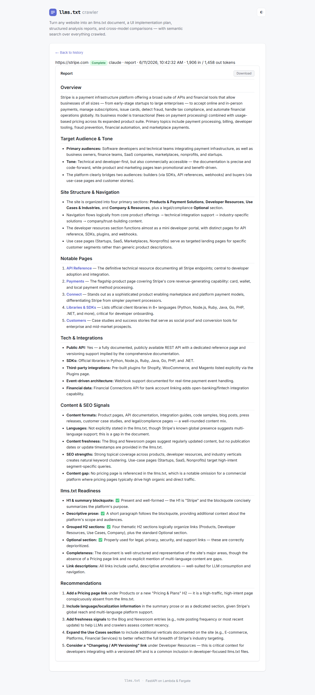</a> 
      <b>Report</b> · structured analysis
    </td>
  </tr>
  <tr>
    <td align="center" valign="top">
      <a href="img/compare.png">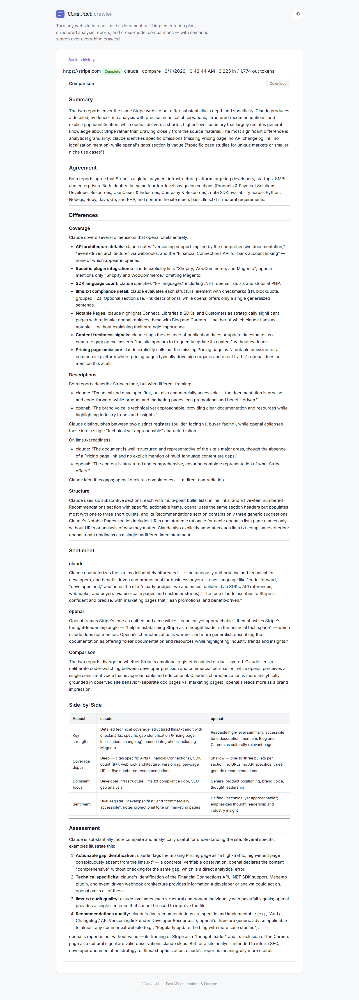</a> 
      <b>Compare</b> · cross-model diff
    </td>
    <td align="center" valign="top">
      <a href="img/history.png">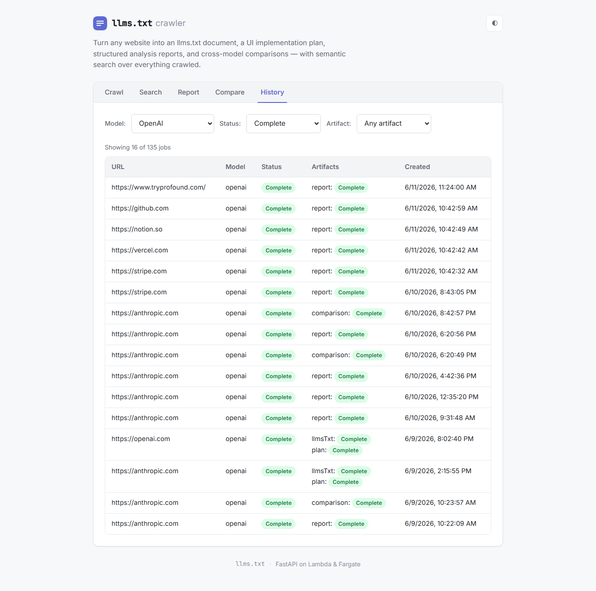</a> 
      <b>History</b> · model/status/artifact filters
    </td>
    <td align="center" valign="top">
      <a href="img/job-detail.png">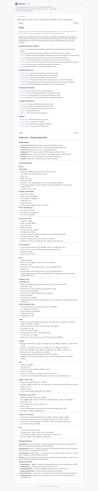</a> 
      <b>Job detail</b> · artifacts + token usage
    </td>
  </tr>
</table>

## Reskin (implement)

The implement step restyles the app's **own** UI using a crawled site's design system, then serves
it live at `/experimental/<jobId>/` and opens a PR — the same app, many different identities.

**Before** — the app's own UI:

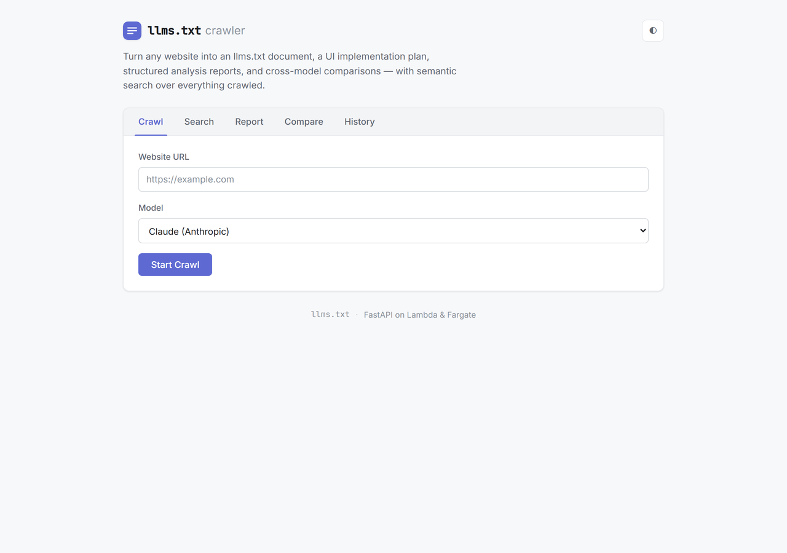

**After** — the same app restyled from each crawled site:

| Stripe | Spotify | Discord | tryprofound |
|---|---|---|---|
| [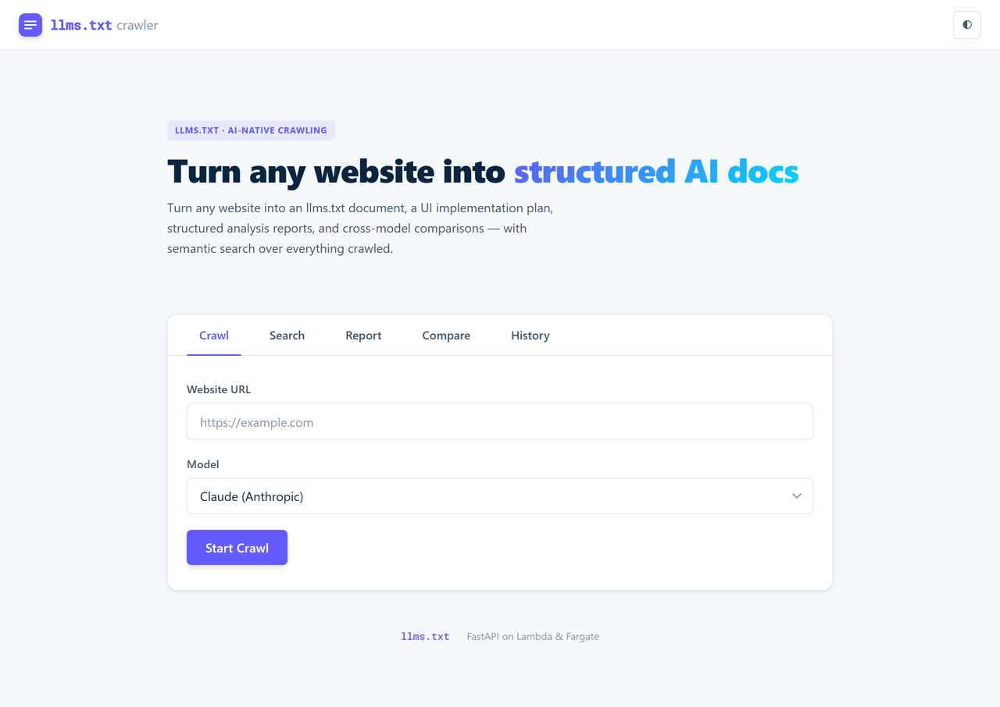](img/reskin-after-stripe.png) | [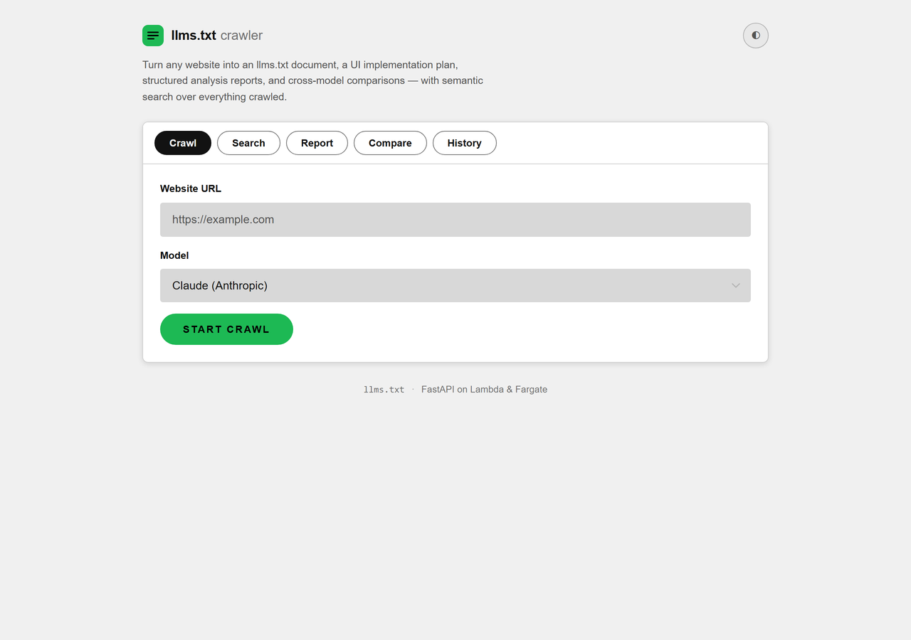](img/reskin-after-spotify.png) | [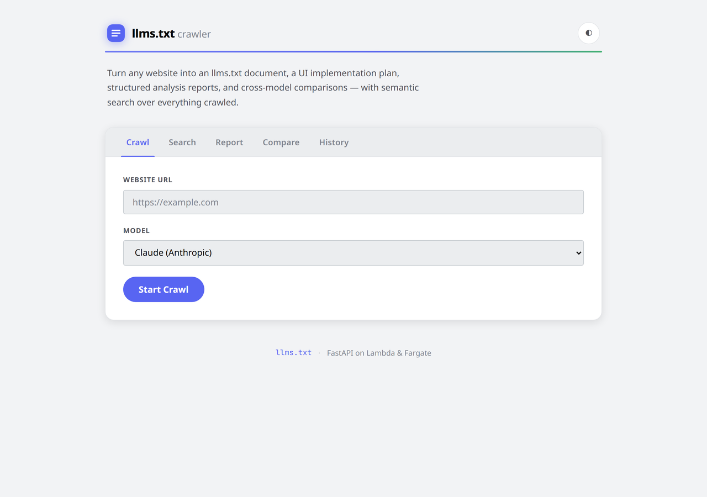](img/reskin-after-discord.png) | [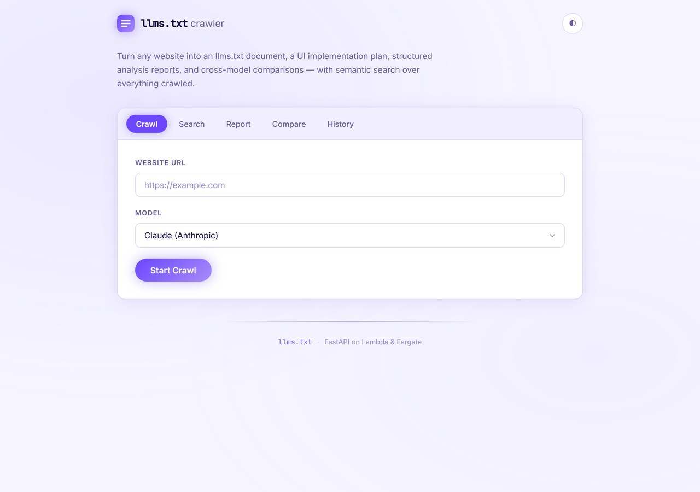](img/reskin-after-tryprofound.png) |
